# 🚗 Carrito Omnidireccional con Ruedas Mecanum - Robotica-2

[](https://www.python.org/)
[](https://www.raspberrypi.org/)
[](LICENSE)

**Proyecto final de Robótica 2 - Carrito independiente con baterías externas**

*Estudiantes: Cristian Alejandro Durán Ignacio, Alfaro Ayzama José Fernando, Ever Rolando Rejas Espinoza*

---

## 📋 Descripción

Sistema de control omnidireccional utilizando cuatro ruedas mecanum controladas por dos módulos Motoron I2C desde una Raspberry Pi 4. El carrito cuenta con un sistema de energía independiente basado en baterías LiPo y puede realizar movimientos en cuatro direcciones: adelante, atrás, lateral derecha y lateral izquierda.

## ✨ Características

- 🎯 **Movimiento omnidireccional** con ruedas mecanum
- 🔋 **Sistema de energía dual independiente** con baterías LiPo 3S
- 🎮 **Control I2C** mediante módulos Motoron M3H
- 📡 **Comunicación dual** con dos controladores (0x10 y 0x11)
- ⚡ **Regulación de voltaje** para protección de componentes
- 🔧 **Código modular** fácil de extender y modificar

## 🧰 Componentes Necesarios

### Hardware Principal
| Componente | Cantidad | Especificaciones |
|------------|----------|------------------|
| Raspberry Pi 4 | 1 | 4GB RAM (recomendado) |
| Módulos Motoron M3H | 2 | Controladores I2C |
| Motores GM25-370 | 4 | Con encoders |
| Ruedas Mecanum | 4 | Omnidireccionales |
| Baterías LiPo | 2 | 3S, 11.1V, 2200mAh |
| Regulador DC-DC | 1 | XL6019 o LM2596S |
| Chasis de aluminio | 1 | Estructura base |
| MicroSD | 1 | 32GB+ Clase 10 |

### Herramientas y Accesorios
- Multímetro
- Protoboard
- Cables jumper
- Fuente de alimentación (para pruebas)
- Destornilladores

<p >
  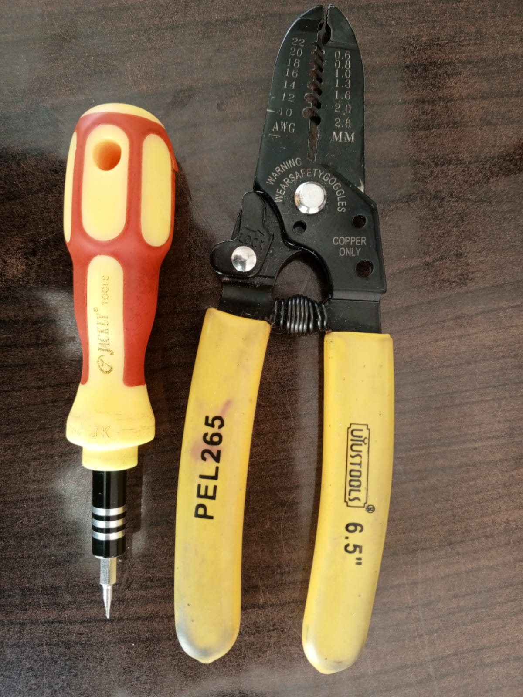
  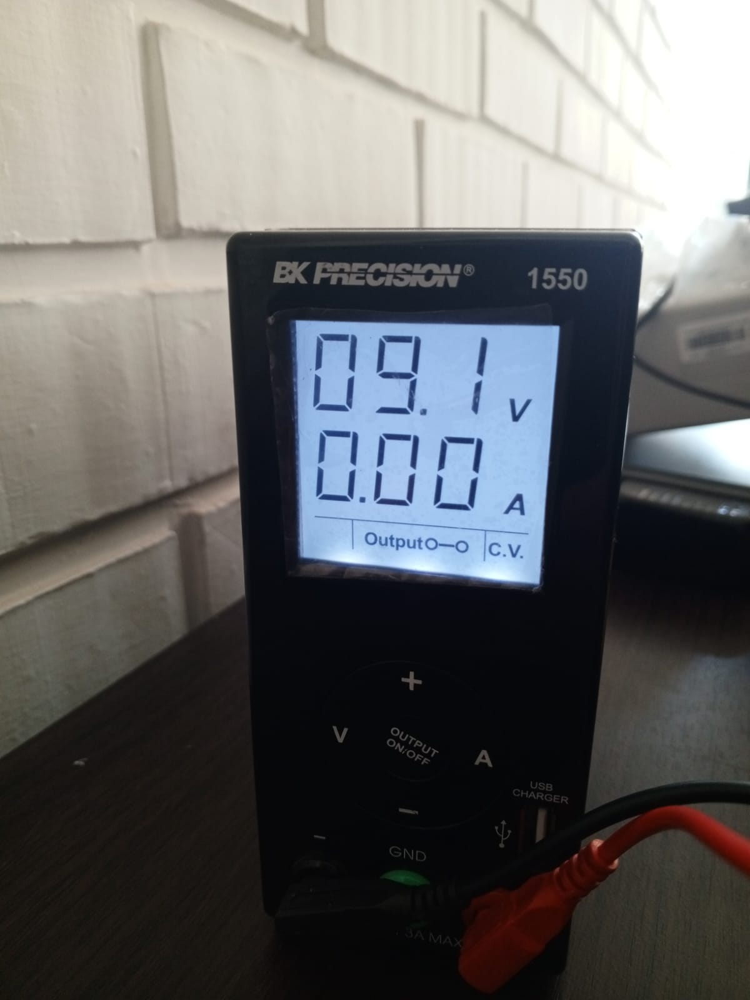
  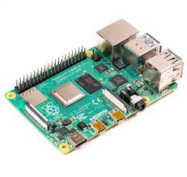
  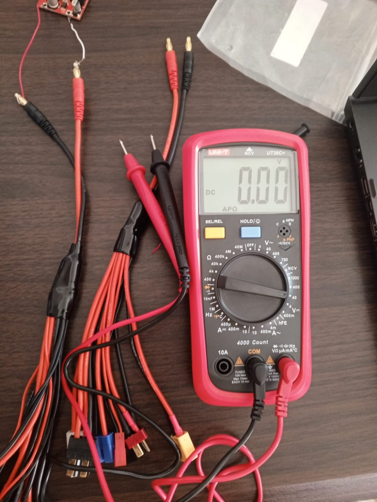
  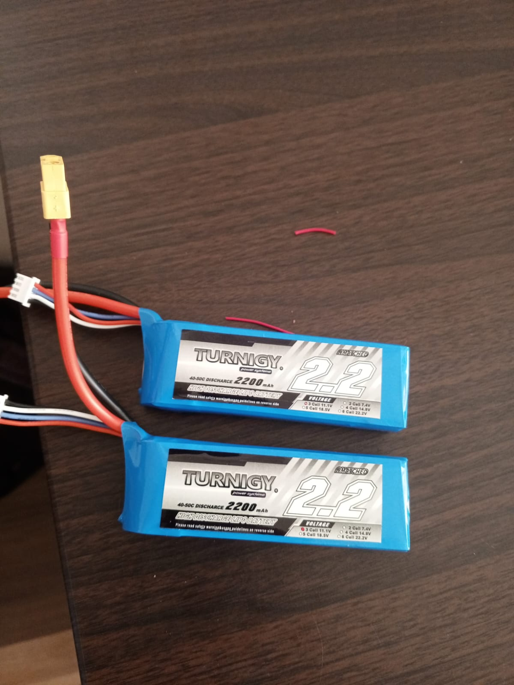
  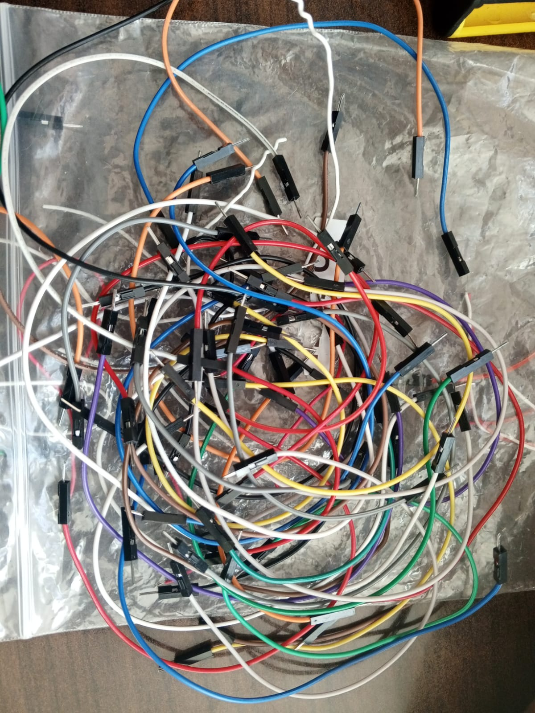
  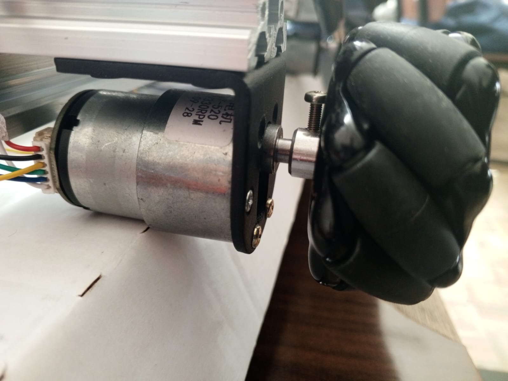
  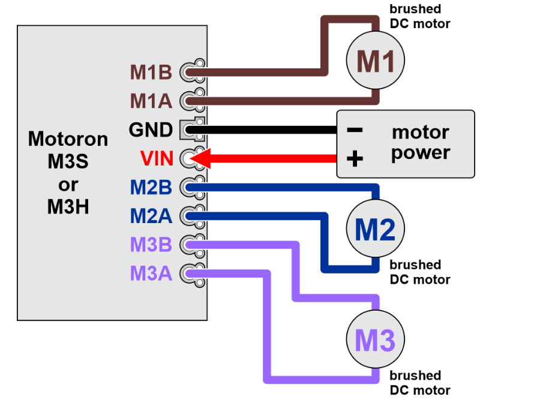
  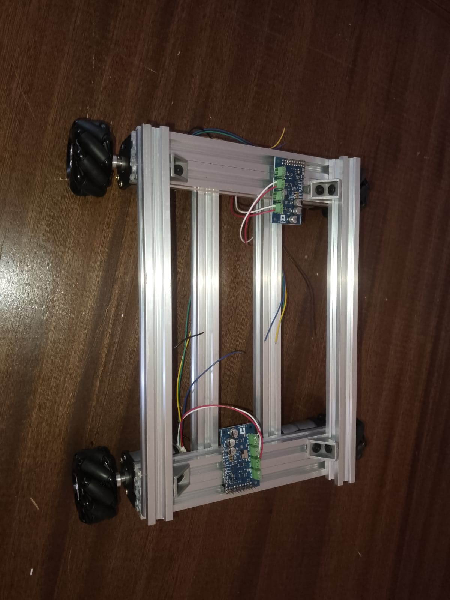
  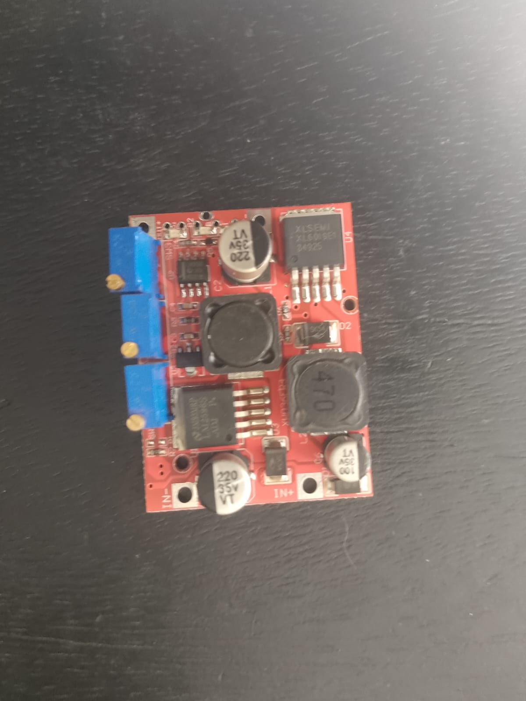
</p>

---

## 🚀 Guía de Construcción por Fases

### 📟 FASE 1: Instalación del Sistema Operativo

#### 1.1 Preparación de la Raspberry Pi
```bash
# Descargar Raspberry Pi Imager desde:
# https://www.raspberrypi.org/software/

# Configurar MicroSD con Raspberry Pi OS
# Habilitar SSH y I2C en configuración avanzada
```

#### 1.2 Primera configuración
```bash
# Después del primer arranque
sudo raspi-config

# Navegar a:
# - Interfacing Options → I2C → Enable
# - Advanced Options → Expand Filesystem
# - Reboot
```

#### 1.3 Instalación de dependencias básicas
```bash
# Actualizar sistema
sudo apt update && sudo apt upgrade -y

# Instalar herramientas necesarias
sudo apt install python3-pip python3-dev i2c-tools git -y

# Verificar I2C
i2cdetect -y 1
```

---

### 🔧 FASE 2: Prueba con Dos Motores

#### 2.1 Armado básico del chasis
1. Montar la Raspberry Pi en el chasis de aluminio
2. Instalar 2 motores GM25-370 en posiciones opuestas
3. Conectar las ruedas mecanum a los motores

<p align="center">
  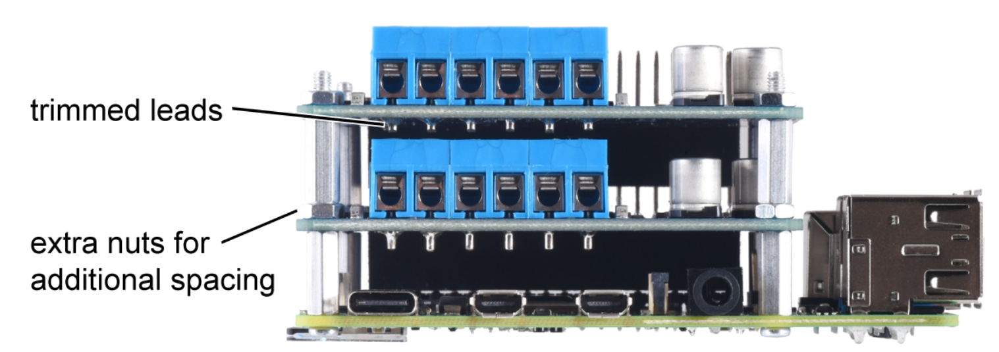
  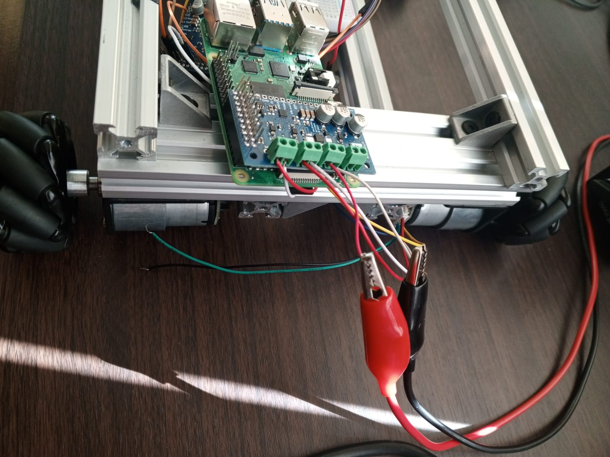
</p>

#### 2.2 Conexiones eléctricas - Configuración básica

**Raspberry Pi ↔ Módulo Motoron M3H:**
```
RPi Pin 3 (SDA) → Motoron SDA
RPi Pin 5 (SCL) → Motoron SCL  
RPi Pin 6 (GND) → Motoron GND
```

**Motores ↔ Módulo Motoron:**
```
Motor 1: M1+ → M2A, M1- → M2B
Motor 2: M2+ → M3A, M2- → M3B
```

**Alimentación temporal:**
```
Fuente regulada 9V → VIN del módulo
Raspberry Pi → Cable USB-C original
```

<p align="center">
  
</p>

#### 2.3 Instalación de librerías
```bash
# Instalar librería Motoron
pip3 install motoron

# Instalar RPi.GPIO
pip3 install RPi.GPIO

# Verificar instalación Python
python3 --version
```

#### 2.4 Código de prueba para dos motores
```bash
# Clonar repositorio de Pololu (referencia)
git clone https://github.com/pololu/motoron-python

# Verificar conexión I2C
i2cdetect -y 1
# Debe mostrar dirección 0x10
```
<p align="center">
  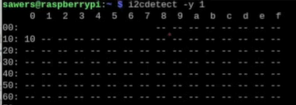
</p>

#### 2.5 Ejecutar prueba básica
```bash
# Crear y ejecutar archivo de prueba
python3 prueba_dos_motores.py
```

**Secuencia de movimientos esperada:**
- Adelante (2 segundos)
- Atrás (2 segundos)
- Pausa entre movimientos

<p align="center">
  
</p>

---

### 🔋 FASE 3: Sistema de Energía Independiente

#### 3.1 Configuración del regulador de voltaje
1. **Configurar regulador XL6019/LM2596S:**
   - Entrada: Batería LiPo 11.1V
   - Salida: Ajustar a 5V exactos (usar multímetro)
   - Verificar polaridad antes de conectar

2. **Esquema de alimentación dual:**
```
Batería LiPo 1 (11.1V) → Regulador → Raspberry Pi (5V)
Batería LiPo 2 (11.1V) → Módulos Motoron (VIN directo)
```

<p align="center">
  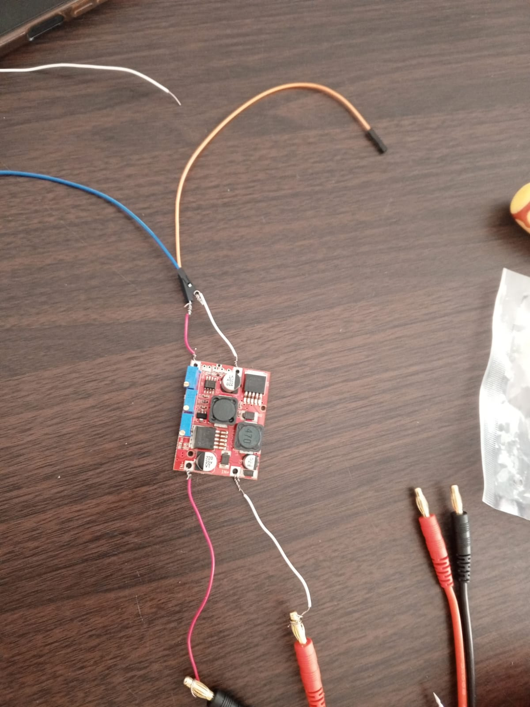
</p>

⚠️ **ADVERTENCIA:** Nunca conectar 11.1V directamente a la Raspberry Pi

---

### 🚗 FASE 4: Ensamblaje Completo del Carrito

#### 4.1 Instalación de todos los componentes
1. Montar los 4 motores GM25-370 en el chasis
2. Instalar todas las ruedas mecanum (verificar orientación)
3. Configurar el segundo módulo Motoron a dirección 0x11
4. Conectar ambos módulos en paralelo

#### 4.2 Conexiones completas

**Raspberry Pi ↔ Ambos Módulos Motoron (paralelo):**
```
RPi Pin 3 (SDA) → SDA módulo 1 y módulo 2
RPi Pin 5 (SCL) → SCL módulo 1 y módulo 2
RPi Pin 6 (GND) → GND módulo 1 y módulo 2
```

**Distribución de motores:**
```
Módulo 1 (0x10) - Lado Izquierdo:
├── Motor Delantero Izq → M2A, M2B
└── Motor Trasero Izq   → M3A, M3B

Módulo 2 (0x11) - Lado Derecho:
├── Motor Delantero Der → M2A, M2B
└── Motor Trasero Der   → M3A, M3B
```

<p align="center">
  
  
  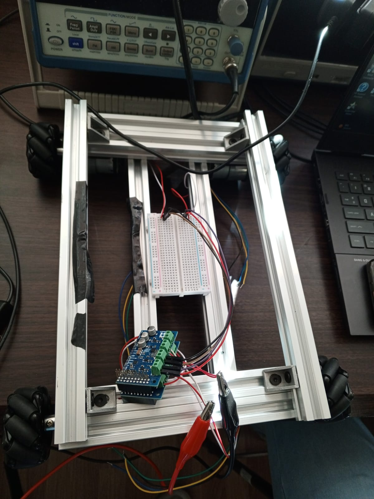
</p>

#### 4.3 Conexión de encoders (opcional)
```
Motor 1 Encoder → GPIO 14, 15
Motor 2 Encoder → GPIO 17, 27
Motor 3 Encoder → GPIO 22, 23
Motor 4 Encoder → GPIO 24, 25
```

<p align="center">
  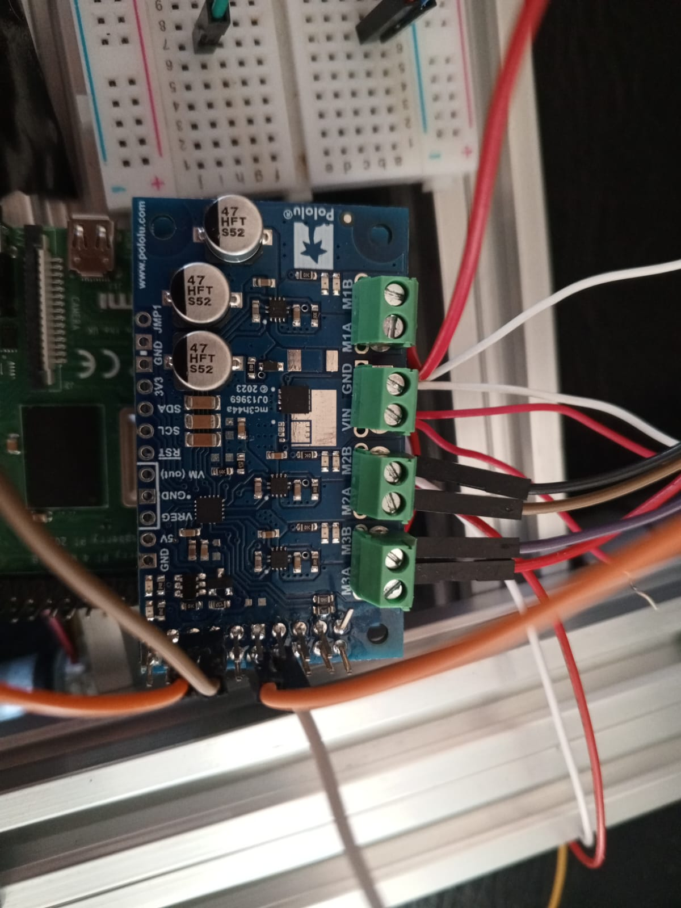
</p>

#### 4.4 Sistema de energía final
```
Batería LiPo 1 → Regulador DC-DC → Raspberry Pi (5V)
Batería LiPo 2 → VIN ambos módulos Motoron (11.1V)
Tierras comunes conectadas
```

---

## 💻 Instalación y Uso

### Instalación rápida
```bash
# Clonar el repositorio
git clone  https://github.com/Josefer98/Robotica2_carrito_independiente.git
cd Robotica2_carrito_independiente/codigo

# Instalar dependencias
pip3 install -r requirements.txt

# Verificar conexión de ambos módulos
i2cdetect -y 1
# Debe mostrar direcciones 0x10 y 0x11
```

### Configuración I2C
```python
MC1_ADDR = 0x10  # Módulo controla motores izquierdos
MC2_ADDR = 0x11  # Módulo controla motores derechos
```

### Ejecución del código principal
```bash
# Ejecutar carrito completo
python3 codigomotor.py
```

**Secuencia de movimientos:**
- Adelante (flecha arriba)
- Atrás (flecha abajo)
- Derecha (flecha izquierda)
- Izquierda (flecha derecha)

---

## 🔧 Resolución de Problemas

### Verificaciones básicas
```bash
# Verificar I2C
i2cdetect -y 1

# Verificar instalación de librerías
python3 -c "import motoron; print('✅ Motoron OK')"

# Verificar voltajes con multímetro
# - Batería LiPo: ~11.1V (cargada)
# - Salida regulador: 5.0V exactos
# - VIN módulos: 11.1V
```

### Problemas comunes

| Problema | Causa | Solución |
|----------|-------|----------|
| Módulos no detectados | I2C deshabilitado | `sudo raspi-config` → habilitar I2C |
| Motores no se mueven | Sin alimentación | Verificar conexión baterías |
| Movimientos erráticos | Conexiones flojas | Revisar continuidad con multímetro |
| Error de importación | Librería faltante | `pip3 install motoron` |

---


## 🎮 Movimientos del Carrito

| Dirección | Descripción |
|-----------|-------------|
| ⬆️ Adelante | Avance frontal | 
| ⬇️ Atrás | Retroceso |
| ➡️ Derecha | Desplazamiento lateral |
| ⬅️ Izquierda | Desplazamiento lateral |

---

<div align="center">

**🎬 Demostración**

<p align="center">
  
</p>

</div>

## 📊 Especificaciones Técnicas

### Sistema de energía
- **Baterías**: 2x LiPo 3S (11.1V, 2200mAh)
- **Regulación**: DC-DC a 5V para Raspberry Pi
- **Autonomía estimada**: 2-3 horas de uso continuo

### Comunicación
- **Protocolo**: I2C
- **Direcciones**: 0x10 (izquierdo), 0x11 (derecho)
- **Velocidad**: Bus I2C estándar (100kHz)

---

## 📚 Referencias y Documentación

- [Librería Motoron Python](https://github.com/pololu/motoron-python)
- [Documentación Motoron M3H](https://www.pololu.com/docs/0J84/)
- [Raspberry Pi I2C Setup](https://www.raspberrypi.org/documentation/)

---

## 🎯 Notas Importantes

⚠️ **Seguridad:**
- Verificar siempre las conexiones antes de energizar
- Usar multímetro para confirmar voltajes
- Asegurar que I2C esté habilitado: `sudo raspi-config`
- Mantener tierras comunes entre sistemas

🔋 **Baterías LiPo:**
- Cargar con cargador específico para LiPo
- No descargar por debajo de 3.0V por celda
- Almacenar a voltaje de almacenamiento (3.8V/celda)

---

## 👥 Autores

- **Cristian Alejandro Durán Ignacio** 
- **Alfaro Ayzama José Fernando** 
- **Ever Rolando Rejas Espinoza**

