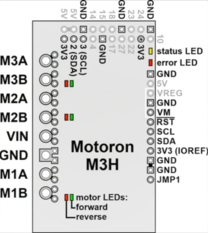
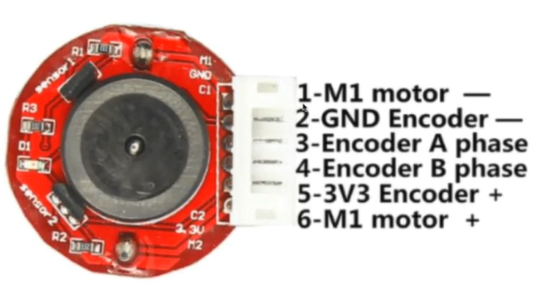

# Robotica2_carrito_independiente
## Nombres: Cristian Alejandro Durán Ignacio - Alfaro Ayzama José Fernando - Ever Rolando Rejas Espinoza

# 🚀 Proyecto final carrito independiente con baterias externas

💡 Este proyecto muestra cómo controlar un conjunto de cuatro ruedas mecanum omnidireccionales usando dos módulos Motoron I2C desde una Raspberry Pi 4, con fuentes de energia independientes

## 📌 Introducción

Utilizamos dos controladores Motoron (direcciones I2C `0x10` y `0x11`) para manejar cuatro motores con ruedas mecanum, logrando movimientos en cuatro direcciones: adelante, atrás, lateral derecha y lateral izquierda, conecetados a 2 baterias Lipo de 3 celdas con capacidad de 2200 mAh y un voltaje de 11.1 V (3 celdas). 

## 🧰 Tecnologías y Librerías

- **Python 3**  
- **motoron** (driver I2C para módulos Motoron) (https://github.com/pololu/motoron-python)   
- **time** (para temporización)
- [RPi.GPIO](https://pypi.org/project/RPi.GPIO/) para control de pines en la Raspberry Pi
- 2 Baterias lipo
- cables de coneccion
- protoboard
- 4 motores GM25-370 con encoders
  
## 🚀 Para  ejecución de código
### Clonar el repositorio
Copiar código
```bash
git clone https://github.com/Cristian-duran/RobotCt_Omni_Wheel
```
Copiar el codigo en un entorno para poder ejecutarlo

### Dependencias y librerías necesarias en el rasberry
🔧 ejecutar en una terminal para tener todo lo necesario:
```bash
pip install -r requirements.txt
```

para los motores (motoron)
```bash
pip install motoron

```
### Verificar si estan conectados los dos modulos necesarios

ambos módulos Motoron deben estar conectados a la Raspberry Pi vía I2C.

<p>
  
</p>

### Ajusta las direcciones I2C si fuese necesario:

```bash
MC1_ADDR = 0x10  # módulo controla motores 1 y 2 (izquierdas)
MC2_ADDR = 0x11  # módulo controla motores 3 y 4 (derechas)
```
### verificar la coneccion de ambos modulos ejecutando el comando en la terminal
```bash
i2cdetect -y 1
```
```bash
i2cdetect -y 2
```
<p>
  
</p>

## 🛠️Conecciones necesarias 
### Conectamos los dos modulos con la rasberry pi 4 paralelamente

<p>
  
</p>

### conectados los motores a los motores a las entradas M2 y M3 de ambos modulos (2 motores para un modulo)

<p>
  
</p>

<p>
  
</p>

### coneccion de los encoders a los pines gpio 14 , 15 , 17 y 27 de la rasberry pi 4

<p>
  
</p>

<p>
  
</p>

<p>
  
</p>

### conectamos a las fuentes de energia para los motores y para la raberry pi 4
tomar en cuenta el votalaje y las tierras tando de motores como de las rasberry pi 4

### Referencias 

https://github.com/pololu/motoron-python 
https://www.pololu.com/docs/0J84/

## 🍓Ejecucion de codigo 
### Abrir el codigo y ejecurtar en una teminal o correr desde un editor de codigo
```bash
python codigomotor.py
```

Se vera en consola la secuencia de movimientos:

Adelante (2 s)

Atrás (2 s)

Derecha (2 s)

Izquierda (2 s)

## 📌 Nota importante
Asegúrarnos de que el bus I2C esté habilitado en tu Raspberry Pi (raspi-config).

## Demostracion

