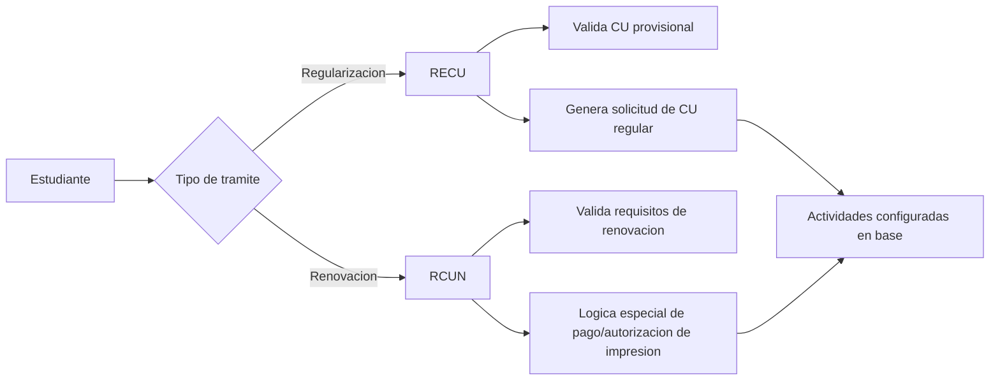
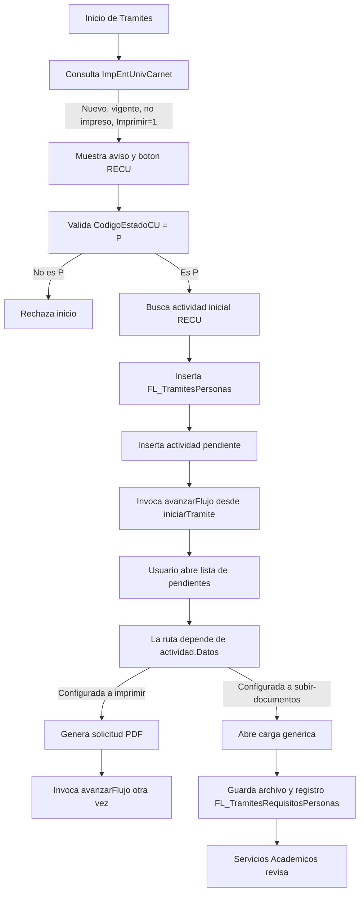

# Regularizacion de Carnet Universitario

## Objetivo

Este documento describe lo que existe actualmente en el proyecto para el proceso de regularizacion del Carnet Universitario, cuyo codigo de proceso es `RECU`.

El documento sirve para:

- Entender el flujo actual.
- Verificar la configuracion en SQL Server sin modificar datos.
- Confirmar si el estudiante puede subir documentos.
- Identificar que depende de la plataforma de Servicios Academicos.
- Preparar una prueba controlada en una base de desarrollo.

> Las consultas de este documento son de solo lectura. No ejecutar `INSERT`, `UPDATE` ni `DELETE` en produccion.

## Resumen ejecutivo

El proyecto contiene estas piezas:

1. Un proceso `RECU` que valida el estado provisional del Carnet Universitario.
2. Una consulta de carnets nuevos pendientes de impresion.
3. Un aviso en el inicio del modulo de Tramites para esos casos.
4. Una solicitud PDF de Carnet Universitario Regular.
5. Un motor generico para actividades y requisitos.
6. Una pantalla generica para subir documentos.
7. Tablas para asociar requisitos al proceso y registrar archivos subidos.

Sin embargo, la posibilidad real de subir documentos para `RECU` depende de la configuracion de la base de datos. El codigo no tiene una pantalla exclusiva llamada `regularizacion`; reutiliza el flujo generico de actividades y requisitos.

## Distincion importante: RECU y RCUN

En el codigo revisado, regularizacion y renovacion no comparten el mismo codigo de proceso:

| Codigo | Significado usado en el codigo | Comportamiento explicito encontrado |
|---|---|---|
| `RECU` | Regularizacion de CU | `DefaultController` permite iniciar si `CodigoEstadoCU = 'P'`; `TramitesController::actionImprimirSolicitud()` tiene un `case "RECU"` que genera `_solicitudCUVigente.php`, una solicitud para emitir el carnet universitario regular. |
| `RCUN` | Renovacion de CU | `DefaultController` tiene validaciones propias; `TramitesService` aplica logica especial de codigo de tramite/precio y la API de pago QR ejecuta `registrarImpCarnetUniv` y avanza el flujo. |

Por lo tanto, con la evidencia del repositorio no corresponde afirmar que ambos se manejan bajo `RECU`. Comparten infraestructura general de tramites/actividades, pero el codigo distingue las operaciones mediante `CodigoProceso`.

En la impresion PDF revisada hay un `case "RECU"`, pero no se encontro un `case "RCUN"`. La solicitud o impresion asociada a `RCUN` podria estar resuelta por otra actividad/ruta configurada en `FL_ProcesosActividades.Datos`, por otro sistema o por un proceso administrativo. La base de datos y la plataforma de Servicios Academicos deben confirmar esa parte.

La hipotesis de que solo cambia la impresion final debe verificarse comparando actividades y destinos de ambos codigos en SQL. Hasta hacerlo, la conclusion segura es: **son codigos distintos con logicas especificas distintas; la configuracion de base puede hacer que compartan alguna pantalla o etapa, pero no se ha demostrado que compartan el codigo de proceso**.


```mermaid
flowchart LR
    A[Estudiante] --> B{Tipo de tramite}
    B -->|Regularizacion| C[RECU]
    C --> D[Valida CU provisional]
    C --> E[Genera solicitud de CU regular]
    B -->|Renovacion| F[RCUN]
    F --> G[Valida requisitos de renovacion]
    F --> H[Logica especial de pago/autorizacion de impresion]
    E --> I[Actividades configuradas en base]
    H --> I
```

## Flujo funcional actual

```text
Universitario inicia sesion
        |
        v
Modulo Tramites / actionIndex
        |
        v
Consulta ImpEntUnivCarnet
        |
        +-- Existe registro nuevo, vigente, no impreso y marcado para imprimir
        |       |
        |       v
        |   Se muestra aviso de regularizacion
        |       |
        |       v
        |   Enlace al proceso RECU
        |
        v
DefaultController::actionValidarTramite
        |
        +-- Verifica CodigoEstadoCU = P
        |
        v
DefaultController::iniciarTramite
        |
        +-- Crea FL_TramitesPersonas
        +-- Crea FL_ActividadesTramitesPersonas
        |
        v
Actividad pendiente configurada en la base de datos
        |
        +-- Puede apuntar a impresion de solicitud
        +-- Puede apuntar a subida de documentos
        +-- Puede apuntar a otra actividad administrativa
        |
        v
Servicios Academicos revisa, observa o valida
```

## Codigo relacionado

### Deteccion y aviso inicial

Archivo: `modules/Tramites/controllers/DefaultController.php`

En `actionIndex()` se obtiene el CU de la identidad y se llama a:

```php
$impresionesPendientes = $tramitesDAO->obtenerImpresionCU($cu);
$mostrarAvisoRegularizacion = !empty($impresionesPendientes);
```

El resultado se envia a la vista inicial mediante:

```php
'mostrarAvisoRegularizacion' => $mostrarAvisoRegularizacion
```

Archivo: `modules/Tramites/models/TramitesDao.php`

El metodo `obtenerImpresionCU($cu)` consulta `ImpEntUnivCarnet` con estas condiciones:

```sql
Observaciones LIKE '%Nuevo%'
AND FechaHoraImpresion IS NULL
AND Imprimir = 1
AND EsVigente = 1
```

Esto significa que el sistema detecta un carnet nuevo pendiente de impresion. No demuestra por si solo que la causa sea falta de documentacion.

Archivo: `modules/Tramites/views/default/index.php`

Si la consulta devuelve datos, la vista muestra el aviso de regularizacion y un enlace a:

```text
/Tramites/default/validar-tramite?codigoProceso=RECU&inicio=1
```

### Validacion del proceso RECU

Archivo: `modules/Tramites/controllers/DefaultController.php`

La validacion actual es:

```php
if ($codigoProceso == 'RECU') {
    if ($estadoCU != 'P') {
        // No permite regularizacion si el Carnet no es provisional
        $iniciarTramite = false;
    }
}
```

Por tanto, el codigo `RECU` solo permite iniciar el tramite cuando:

```text
Universitarios.CodigoEstadoCU = 'P'
```

### Creacion del tramite

El metodo `iniciarTramite()` crea:

```text
FL_TramitesPersonas
FL_ActividadesTramitesPersonas
```

La actividad inicial se obtiene de:

```text
FL_ProcesosActividades
```

con:

```text
CodigoProceso = 'RECU'
TipoActividad = 1
```

La actividad debe existir y estar correctamente configurada. Si no existe, el tramite no puede iniciar.

### Solicitud PDF

Archivo: `modules/Tramites/controllers/TramitesController.php`

El `case "RECU"` genera una solicitud PDF usando:

```text
modules/Tramites/views/tramites/_solicitudCUVigente.php
```

El texto de la solicitud indica que el estudiante solicita la emision de un Carnet Universitario Regular.

Este paso no carga documentos por si mismo. Genera la solicitud y avanza la actividad pendiente.

## Modulo generico de carga de documentos

El proyecto si tiene un modulo generico para subir archivos.

### Controlador

Archivo:

```text
modules/Tramites/controllers/TramitesController.php
```

Metodo:

```php
actionSubirDocumentos($codigoProceso, $idTramite)
```

Este metodo llama a:

```php
TramitesDao::procesarSubidaDocumentos($codigoProceso, $idTramite)
```

### Servicio DAO

Archivo:

```text
modules/Tramites/models/TramitesDao.php
```

Metodo:

```php
procesarSubidaDocumentos($codigoProceso, $idTramite)
```

El metodo:

1. Busca el tramite.
2. Busca la actividad pendiente.
3. Carga el archivo enviado.
4. Lo guarda en `pathDocTemp`.
5. Registra el archivo en `FL_TramitesRequisitosPersonas`.
6. Busca el siguiente requisito pendiente.
7. Avanza el flujo cuando no quedan requisitos.

### Vista

Archivo:

```text
modules/Tramites/views/tramites/subirDocumentos.php
```

La vista muestra un requisito por vez y genera un formulario multipart para subir un archivo.

### Como se selecciona la pantalla

Archivo:

```text
modules/Tramites/views/tramites/pendientes.php
```

La URL de la actividad se construye usando el campo:

```php
$model->actividad->Datos
```

Por esto, para que una actividad de `RECU` abra la pantalla de carga, el valor de `Datos` debe apuntar a la ruta de la accion de subida, por ejemplo:

```text
tramites/subir-documentos
```

La ruta exacta debe confirmarse con las rutas configuradas en la aplicacion.

## Tablas involucradas

### Datos del estudiante

```text
Personas
PersonasPW
Universitarios
```

Relaciones esperadas:

```text
Personas.IdPersona = PersonasPW.IdPersona
Personas.IdPersona = Universitarios.IdPersona
Universitarios.CU = CU del tramite
```

Para la prueba de regularizacion normalmente se necesita:

```text
Universitarios.CodigoEstadoCU = 'P'
```

### Carnet pendiente de impresion

```text
ImpEntUnivCarnet
```

Esta tabla es consultada por `obtenerImpresionCU()`.

Condicion actualmente usada:

```text
Observaciones contiene Nuevo
FechaHoraImpresion es NULL
Imprimir = 1
EsVigente = 1
```

### Definicion del proceso

```text
FL_Procesos
```

Contiene el proceso visible, su descripcion y su estado.

### Actividades del proceso

```text
FL_ProcesosActividades
```

Contiene:

- Actividad.
- Tipo de actividad.
- Ruta o destino en `Datos`.
- Siguiente actividad.
- Actividad anterior.
- Tipo de transaccion.
- Estado.

### Roles de las actividades

```text
FL_ActividadesRoles
```

Determina que rol puede atender o avanzar una actividad.

### Requisitos de una actividad

```text
FL_ActividadesRequisitos
FL_Requisitos
FL_RequisitosTiposArchivos
```

Estas tablas determinan:

- Que documento se solicita.
- En que actividad se solicita.
- Que tipo de archivo se acepta.
- Que foja corresponde.

### Tramite concreto del estudiante

```text
FL_TramitesPersonas
FL_ActividadesTramitesPersonas
```

Estas tablas registran:

- El tramite del estudiante.
- La actividad actual.
- El estado pendiente.
- El usuario que lo inicio.

### Archivos enviados

```text
FL_TramitesRequisitosPersonas
```

Campos relevantes:

```text
IdTramite
IdRequisito
NombreArchivo
Foja
VerificacionPersona
VerificacionVentanilla
CodigoUsuarioVentanilla
FechaHoraRegistro
```

## Consultas de diagnostico

Las siguientes consultas son de solo lectura.

### 1. Verificar que existe el proceso RECU

```sql
SELECT
    CodigoProceso,
    NombreProceso,
    CodigoEstado,
    IniciaDesdeTramite,
    Descripcion,
    IconProceso
FROM FL_Procesos
WHERE CodigoProceso = 'RECU';
```

Interpretacion:

- Una fila confirma que el proceso existe.
- `CodigoEstado = 'V'` indica proceso vigente.
- `IniciaDesdeTramite = 1` permite mostrarlo en el listado de Tramites.

### 2. Ver todas las actividades de RECU

```sql
SELECT
    CodigoProceso,
    IdActividad,
    Actividad,
    TipoActividad,
    Datos,
    EtiquetaBoton,
    IdActividadSiguientes,
    IdActividadAnteriores,
    CodigoTipoTransaccion,
    CodigoEstado
FROM FL_ProcesosActividades
WHERE CodigoProceso = 'RECU'
ORDER BY IdActividad;
```

Verificar especialmente:

- Existe una actividad con `TipoActividad = 1`.
- `Datos` de la actividad inicial apunta a la pantalla esperada.
- La siguiente actividad permite continuar el flujo.
- Las actividades estan vigentes.

### 2a. Comparar definicion y actividades de RECU y RCUN

```sql
SELECT
    p.CodigoProceso,
    p.NombreProceso,
    p.CodigoEstado AS EstadoProceso,
    p.IniciaDesdeTramite,
    a.IdActividad,
    a.Actividad,
    a.TipoActividad,
    a.Datos,
    a.EtiquetaBoton,
    a.IdActividadSiguientes,
    a.CodigoTipoTransaccion,
    a.CodigoEstado AS EstadoActividad
FROM FL_Procesos p
LEFT JOIN FL_ProcesosActividades a
    ON a.CodigoProceso = p.CodigoProceso
WHERE p.CodigoProceso IN ('RECU', 'RCUN')
ORDER BY p.CodigoProceso, a.TipoActividad, a.IdActividad;
```

Esta consulta confirma si la base tiene dos procesos separados y si sus actividades apuntan a la misma pantalla (`Datos`) o a destinos distintos.

### 2b. Comparar codigos de tramite/caja

```sql
SELECT
    CodigoProceso,
    CodigoTramite
FROM FL_ProcesosCajaTramites
WHERE CodigoProceso IN ('RECU', 'RCUN')
ORDER BY CodigoProceso;
```

Una fila para cada codigo sugiere configuraciones de caja distintas; la ausencia de fila no prueba por si sola que no exista un costo o flujo en otro sistema.

### 2c. Comparar tramites existentes

```sql
SELECT
    CodigoProceso,
    COUNT(*) AS CantidadTramites,
    SUM(CASE WHEN CodigoEstado = 'V' THEN 1 ELSE 0 END) AS CantidadVigentes,
    MAX(FechaHoraInicio) AS UltimoInicio
FROM FL_TramitesPersonas
WHERE CodigoProceso IN ('RECU', 'RCUN')
GROUP BY CodigoProceso
ORDER BY CodigoProceso;
```

Esta consulta permite comprobar si ambos codigos se han usado como procesos separados en la base.

### 3. Ver los roles de RECU

```sql
SELECT
    ar.CodigoProceso,
    ar.IdActividad,
    ar.IdRol,
    ar.CodigoEstado,
    pa.Actividad
FROM FL_ActividadesRoles ar
INNER JOIN FL_ProcesosActividades pa
    ON pa.CodigoProceso = ar.CodigoProceso
   AND pa.IdActividad = ar.IdActividad
WHERE ar.CodigoProceso = 'RECU'
ORDER BY ar.IdActividad, ar.IdRol;
```

Si no existen roles para una actividad, el metodo `avanzarFlujo()` puede impedir el avance.

### 4. Ver requisitos configurados para RECU

```sql
SELECT
    ar.CodigoProceso,
    ar.IdActividad,
    ar.IdRequisito,
    r.Descripcion AS Requisito,
    r.CodigoEstado AS EstadoRequisito,
    rta.CodigoTipoArchivo,
    rta.CodigoEstado AS EstadoArchivo,
    rta.Foja
FROM FL_ActividadesRequisitos ar
INNER JOIN FL_Requisitos r
    ON r.IdRequisito = ar.IdRequisito
LEFT JOIN FL_RequisitosTiposArchivos rta
    ON rta.IdRequisito = r.IdRequisito
WHERE ar.CodigoProceso = 'RECU'
ORDER BY ar.IdActividad, ar.IdRequisito, rta.Foja;
```

Interpretacion:

- Sin filas: no hay requisitos documentales configurados para RECU.
- Requisito sin `CodigoTipoArchivo`: falta su configuracion de archivo.
- `Foja` indica la hoja o documento esperado.
- Requisitos inactivos pueden no ser validos para el flujo.

### 5. Ver un tramite RECU y su actividad actual

```sql
SELECT
    t.IdTramite,
    t.CodigoProceso,
    t.CU,
    t.IdPersona,
    t.CodigoEstado AS EstadoTramite,
    t.FechaHoraInicio,
    t.FechaHoraFin,
    a.IdActividad,
    a.CodigoEstado AS EstadoActividad,
    pa.Actividad,
    pa.Datos,
    pa.IdActividadSiguientes
FROM FL_TramitesPersonas t
LEFT JOIN FL_ActividadesTramitesPersonas a
    ON a.IdTramite = t.IdTramite
LEFT JOIN FL_ProcesosActividades pa
    ON pa.CodigoProceso = a.CodigoProceso
   AND pa.IdActividad = a.IdActividad
WHERE t.CodigoProceso = 'RECU'
ORDER BY t.IdTramite DESC;
```

La columna mas importante es `Datos`. Permite saber que pantalla se abre para la actividad pendiente.

### 6. Ver requisitos y archivos de un tramite

```sql
DECLARE @IdTramite INT = 12345;

SELECT
    trp.IdTramite,
    trp.IdRequisito,
    r.Descripcion AS Requisito,
    trp.NombreArchivo,
    trp.Foja,
    trp.VerificacionPersona,
    trp.VerificacionVentanilla,
    trp.CodigoUsuarioVentanilla,
    trp.FechaHoraRegistro
FROM FL_TramitesRequisitosPersonas trp
LEFT JOIN FL_Requisitos r
    ON r.IdRequisito = trp.IdRequisito
WHERE trp.IdTramite = @IdTramite
ORDER BY trp.IdRequisito, trp.Foja;
```

Reemplazar `12345` por un `IdTramite` real.

### 7. Ver requisitos pendientes de un tramite

```sql
DECLARE @IdTramite INT = 12345;

SELECT
    ar.IdActividad,
    ar.IdRequisito,
    r.Descripcion AS Requisito,
    rta.CodigoTipoArchivo,
    rta.Foja
FROM FL_TramitesPersonas t
INNER JOIN FL_ActividadesTramitesPersonas atp
    ON atp.IdTramite = t.IdTramite
   AND atp.CodigoEstado = 'P'
INNER JOIN FL_ActividadesRequisitos ar
    ON ar.CodigoProceso = atp.CodigoProceso
   AND ar.IdActividad = atp.IdActividad
INNER JOIN FL_Requisitos r
    ON r.IdRequisito = ar.IdRequisito
LEFT JOIN FL_RequisitosTiposArchivos rta
    ON rta.IdRequisito = r.IdRequisito
LEFT JOIN FL_TramitesRequisitosPersonas trp
    ON trp.IdTramite = t.IdTramite
   AND trp.IdRequisito = ar.IdRequisito
   AND trp.Foja = rta.Foja
WHERE t.IdTramite = @IdTramite
  AND trp.IdRequisito IS NULL
ORDER BY ar.IdRequisito, rta.Foja;
```

### 8. Buscar estudiantes con carnet nuevo pendiente

```sql
SELECT TOP 100
    u.CU,
    u.IdPersona,
    u.CodigoCarrera,
    u.CodigoEstadoCU,
    c.Observaciones,
    c.FechaHoraImpresion,
    c.Imprimir,
    c.EsVigente
FROM Universitarios u
INNER JOIN ImpEntUnivCarnet c
    ON c.CU = u.CU
WHERE c.Observaciones LIKE '%Nuevo%'
  AND c.FechaHoraImpresion IS NULL
  AND c.Imprimir = 1
  AND c.EsVigente = 1
ORDER BY u.FechaHoraRegistro DESC;
```

### 9. Verificar un estudiante completo para prueba

```sql
SELECT
    u.CU,
    u.IdPersona,
    u.CodigoCarrera,
    u.CodigoEstadoCU,
    CASE WHEN p.IdPersona IS NULL THEN 'NO' ELSE 'SI' END AS TienePersona,
    CASE WHEN pp.IdPersona IS NULL THEN 'NO' ELSE 'SI' END AS TienePersonasPW,
    CASE WHEN NULLIF(pp.pw, '') IS NULL THEN 'NO' ELSE 'SI' END AS TienePassword,
    CASE WHEN NULLIF(pp.EmailValidado, '') IS NULL THEN 'NO' ELSE 'SI' END AS TieneCorreo,
    pp.EstadoEmail
FROM Universitarios u
LEFT JOIN Personas p
    ON p.IdPersona = u.IdPersona
LEFT JOIN PersonasPW pp
    ON pp.IdPersona = u.IdPersona
WHERE u.CU = 'CU_DE_PRUEBA';
```

No incluir el valor de `pp.pw` en reportes o capturas. Basta comprobar si existe.

### 10. Ver si existen observaciones en los tramites

```sql
SELECT TOP 100
    t.IdTramite,
    t.CodigoProceso,
    t.CU,
    t.IdPersona,
    t.CodigoEstado,
    t.Observaciones,
    a.IdActividad,
    a.CodigoEstado AS EstadoActividad,
    pa.Actividad,
    pa.Glosa,
    pa.Datos
FROM FL_TramitesPersonas t
LEFT JOIN FL_ActividadesTramitesPersonas a
    ON a.IdTramite = t.IdTramite
LEFT JOIN FL_ProcesosActividades pa
    ON pa.CodigoProceso = a.CodigoProceso
   AND pa.IdActividad = a.IdActividad
WHERE t.CodigoProceso = 'RECU'
ORDER BY t.IdTramite DESC;
```

Esta consulta no garantiza que la observacion provenga de la plataforma administrativa. Sirve para localizar texto y actividad registrados en el flujo compartido.

## Formatos de archivos actualmente permitidos

Archivo:

```text
modules/Tramites/models/FLTramitesRequisitosPersonas.php
```

Para el escenario normal se aceptan:

```text
jpg, jpeg
```

Limites actuales:

```text
Maximo: 2 MB
Minimo: 10 bytes
Un archivo
```

El PDF se acepta solo en el escenario especial `ESCENARIO_CONTRATO`, usado actualmente por `MCPP`. No se activa automaticamente para `RECU`.

Por eso, si Servicios Academicos necesita que el estudiante suba documentos PDF en `RECU`, este punto debe revisarse antes de una prueba real.

## Dependencias con Servicios Academicos

El codigo de SUNIVER muestra la solicitud y ejecuta acciones del flujo, pero no contiene una logica explicita que determine el motivo documental exacto de la observacion.

Para confirmar el proceso completo se necesita conocer en la otra plataforma:

- Donde se crea o marca la observacion.
- Que tabla registra los documentos faltantes.
- Que tabla cambia la actividad pendiente.
- Como se guarda el texto visible para el estudiante.
- Como se valida un archivo recibido.
- Que procedimiento almacenado ejecuta el avance o rechazo.
- Si usa las mismas tablas `FL_*` de la base `Academica`.

El acceso recomendado es un usuario de prueba con permisos limitados en ambas plataformas:

```text
SUNIVER: rol estudiante
Servicios Academicos: rol de revision de RECU
Base: datos de desarrollo o caso de prueba controlado
```

No es necesario solicitar acceso de administrador total.

## Criterios para considerar que RECU esta listo

El flujo puede considerarse funcional cuando se verifica todo lo siguiente:

- El estudiante con `CodigoEstadoCU = 'P'` ve el aviso correcto.
- El proceso `RECU` aparece en el listado.
- Se crea `FL_TramitesPersonas`.
- Se crea una actividad pendiente.
- La actividad tiene una ruta valida en `Datos`.
- La ruta abre la pantalla correcta.
- Se muestran los requisitos configurados.
- El formato real del documento es aceptado.
- El archivo se guarda en `pathDocTemp`.
- Se registra en `FL_TramitesRequisitosPersonas`.
- Servicios Academicos puede verlo y verificarlo.
- Un documento observado puede volver a cargarse.
- El flujo avanza solo despues de completar los requisitos.
- La aprobacion final no cambia automaticamente el estado del carnet sin autorizacion administrativa.

## Riesgos y observaciones del codigo

### `queryOne()` en requisitos

`TramitesDao::procesarSubidaDocumentos()` usa `queryOne()` para obtener requisitos pendientes. Si `RECU` tiene varios requisitos, la pantalla muestra uno por vez. Esto puede ser correcto, pero debe probarse.

### Avance al imprimir la solicitud

El `case "RECU"` de `TramitesController` avanza la actividad despues de generar el PDF. La actividad siguiente debe estar configurada correctamente; de lo contrario, puede saltarse la carga documental.

### Seguridad del archivo

El nombre del archivo usa valores enviados por el formulario (`CodigoTipoArchivo` y `Foja`). Para produccion se debe validar que esos valores pertenezcan al requisito real del tramite.

### Causa de la regularizacion

La consulta de `ImpEntUnivCarnet` identifica un carnet nuevo pendiente de impresion, pero no prueba que la causa sea falta de documentos. Para un mensaje exacto se necesita un campo, estado o fuente oficial de Servicios Academicos.

### Base de datos y entorno

La aplicacion usa SQL Server y la configuracion del proyecto apunta a la base `Academica`. Para probar el flujo localmente se necesita:

- Conexion `pdo_sqlsrv` habilitada.
- Acceso autorizado a una base de desarrollo.
- Archivos accesibles en la ruta `pathDocTemp`.
- Usuario de prueba con datos completos.

## Orden recomendado de prueba

1. Obtener un estudiante de prueba existente.
2. Confirmar `Personas`, `PersonasPW` y `Universitarios`.
3. Confirmar `CodigoEstadoCU = 'P'`.
4. Confirmar registro pendiente en `ImpEntUnivCarnet`.
5. Confirmar proceso y actividades `RECU`.
6. Confirmar requisitos y tipos de archivo.
7. Iniciar el proceso desde SUNIVER.
8. Verificar el `IdTramite` creado.
9. Verificar la actividad pendiente y su campo `Datos`.
10. Subir un archivo de prueba no sensible.
11. Verificar `FL_TramitesRequisitosPersonas`.
12. Revisar el tramite desde Servicios Academicos.
13. Observar el tramite con un documento faltante.
14. Volver a cargar el documento corregido.
15. Confirmar el avance y cierre del flujo.

## Conclusiones

El proyecto ya tiene una base reutilizable para implementar la regularizacion:

- Proceso `RECU`.
- Aviso inicial.
- Solicitud PDF.
- Motor de actividades.
- Motor de requisitos.
- Pantalla generica de carga.
- Registro de archivos.

Lo que debe confirmarse antes de ampliar el codigo es si la configuracion actual de `RECU` ya conecta con `subirDocumentos` y si la plataforma de Servicios Academicos es la que crea las observaciones y requisitos faltantes.

Si la configuracion de base de datos ya existe, probablemente el trabajo principal sera corregir el enlace entre actividades, ampliar formatos permitidos y mostrar correctamente las observaciones. Si no existe, habra que configurar el flujo documental y despues crear o ajustar la interfaz del estudiante.

## Informe tecnico del codigo revisado

Fecha de revision: 2026-09-29.

### Estado comprobado en el repositorio

| Capacidad | Estado | Evidencia y limite |
|---|---|---|
| Aviso inicial | Implementado | `DefaultController::actionIndex()` consulta `obtenerImpresionCU()` y pasa el resultado a `index.php`. |
| Condicion del aviso | Implementada, aproximada | Busca carnet nuevo vigente que no se imprimio y tiene `Imprimir = 1`. No demuestra por si sola que falte documentacion. |
| Enlace a `RECU` | Implementado | La vista enlaza a `default/validar-tramite` con `codigoProceso=RECU` e `inicio=1`. |
| Elegibilidad | Implementada | `actionValidarTramite()` solo permite iniciar `RECU` si `CodigoEstadoCU = 'P'`. |
| Registro del tramite | Implementado generico | `iniciarTramite()` inserta el tramite y una actividad inicial configurada como `TipoActividad = 1`. |
| Solicitud PDF | Implementada | El `case RECU` genera `_solicitudCUVigente.php`, que solicita emision de carnet regular. |
| Formulario generico para archivos | Implementado | Existe `actionSubirDocumentos()` y la vista `subirDocumentos.php`. |
| Uso de carga por `RECU` | No comprobado | Depende de `FL_ProcesosActividades.Datos`, de la actividad pendiente y de los requisitos asociados. El codigo no conecta directamente `RECU` con esa pantalla. |
| Observacion/documento faltante | No comprobado | No se encontro una regla de codigo que derive la causa precisa de falta documental desde la fuente de Servicios Academicos. |
| Prueba extremo a extremo | No realizada | La inspeccion fue estatica; no se consulto la base durante esta revision ni se probo un tramite real. |

### Flujo que ejecuta el codigo


```mermaid
flowchart TD
    A[Inicio de Tramites] --> B[Consulta ImpEntUnivCarnet]
    B -->|Nuevo, vigente, no impreso, Imprimir=1| C[Muestra aviso y boton RECU]
    C --> D[Valida CodigoEstadoCU = P]
    D -->|No es P| E[Rechaza inicio]
    D -->|Es P| F[Busca actividad inicial RECU]
    F --> G[Inserta FL_TramitesPersonas]
    G --> H[Inserta actividad pendiente]
    H --> I[Invoca avanzarFlujo desde iniciarTramite]
    I --> J[Usuario abre lista de pendientes]
    J --> K[La ruta depende de actividad.Datos]
    K -->|Configurada a imprimir| L[Genera solicitud PDF]
    L --> M[Invoca avanzarFlujo otra vez]
    K -->|Configurada a subir-documentos| N[Abre carga generica]
    N --> O[Guarda archivo y registro FL_TramitesRequisitosPersonas]
    O --> P[Servicios Academicos revisa]
```

El diagrama muestra las ramas que permite el codigo. No afirma cual rama tiene configurada hoy la base de datos.

### Riesgos concretos encontrados

#### Consulta fija de titulo en la carga inicial

En `DefaultController::actionIndex()` se consulta `PersonasTitulos` usando el identificador fijo `10422119` y luego se leen propiedades de `$misTitulos` para calcular `$Hash`. El resultado no se utiliza en la vista. Si esa consulta devuelve `null`, se intentan leer propiedades de un valor nulo antes del `render()`, lo que puede impedir que cargue todo el inicio, incluido el aviso de regularizacion. Se debe comprobar que la fila existe y retirar o aislar ese bloque si no pertenece al flujo del portal.

#### Avance duplicado o prematuro

`DefaultController::iniciarTramite()` crea la actividad inicial y luego llama a `avanzarFlujo()`. Ademas, el `case RECU` de `TramitesController::actionImprimirSolicitud()` vuelve a avanzar la actividad pendiente despues de generar el PDF.

El procedimiento almacenado `fl_AccionesFlujos` determina el efecto exacto, pero esta secuencia puede adelantar dos veces o saltar una actividad si la configuracion no esta pensada para esos dos avances. Debe revisarse con el historial de un tramite `RECU` real.

#### Requisitos consultados sin limitar por actividad

`TramitesDao::procesarSubidaDocumentos()` busca requisitos con `ar.CodigoProceso = :CodigoProceso`, pero no filtra por `ar.IdActividad` ni por la actividad actual del tramite. Si `RECU` tiene requisitos en varias actividades, la pantalla podria mezclar requisitos de etapas distintas.

La consulta termina con `queryOne()`: presenta un requisito por solicitud. Puede ser intencional para una carga secuencial, pero no muestra una lista completa y debe comprobarse con varios requisitos y fojas.

#### Eliminacion de registros al entrar a la carga

Antes de procesar el formulario, `procesarSubidaDocumentos()` elimina filas de `FL_TramitesRequisitosPersonas` del tramite cuando `VerificacionVentanilla = 0` y `CodigoUsuarioVentanilla IS NOT NULL`.

Esto ocurre al abrir la accion, no solamente al guardar. Hay que confirmar con Servicios Academicos si esa combinacion significa documento observado/rechazado; si es asi, abrir la pantalla podria eliminar el registro previo. No ejecutar pruebas con datos reales hasta aclarar esta regla.

#### Formatos disponibles

El modelo `FLTramitesRequisitosPersonas` acepta `jpg/jpeg` para el escenario normal, con maximo de 2 MB. El escenario PDF de hasta 5 MB solo se activa para `MCPP`. Por lo tanto, la carga de PDFs para `RECU` no esta habilitada por una regla especifica del proceso.

#### Validacion del tramite al cargar archivos

En el action de subida y en el DAO revisados no aparece una comprobacion explicita de que:

- El `IdTramite` pertenezca a la identidad autenticada.
- El `CodigoProceso` recibido coincida con el proceso del tramite.
- El estudiante este en la actividad que permite subir documentos.
- El `IdRequisito`, tipo de archivo y foja enviados correspondan a una configuracion activa de `RECU`.

Puede haber controles generales en otra capa, pero no se ven en esos metodos. Deben verificarse antes de exponer la carga a usuarios.

#### Registro y almacenamiento del archivo

El archivo fisico se guarda primero en `pathDocTemp` y despues se intenta insertar el registro en base. Si la insercion falla, puede quedar un archivo huerfano. Ademas, `codigoTipoArchivo` y `Foja` llegan en campos ocultos del navegador y deben validarse contra la configuracion del requisito.

### Diagnosticos estaticos del archivo controlador

La herramienta de diagnosticos reporta en `DefaultController.php`:

- Posible `$data` indefinido dentro de `actionValidarDatosRectificaciones()`.
- Llamada estatica a `RegularidadController::obtenerMotivo()` aunque el metodo no es estatico; corresponde a `CRAE`.
- Llamada estatica a `FLTramitesDatosRectificaciones::registrarDatosRectificacion()` aunque el metodo no es estatico; corresponde a `REDP`.

Estos diagnosticos no apuntan directamente al bloque `RECU`, pero son errores reales de rutas vecinas en el mismo controlador y conviene mantenerlos separados del analisis funcional de regularizacion.

No se reportaron errores estaticos en `TramitesController.php`, `TramitesDao.php` ni `FLTramitesRequisitosPersonas.php` durante esta inspeccion. Eso no sustituye una prueba funcional.

### Limitacion del aviso actual

El texto visible dice que el carnet no fue impreso por falta de documentacion. Sin embargo, la condicion usada solo encuentra un carnet nuevo pendiente de impresion. Si esa tabla no codifica la causa, el texto afirma mas de lo que el sistema sabe.

Para confirmar la causa se necesita una columna/estado verificable o la fuente que utiliza Servicios Academicos para marcar documentos faltantes. Hasta entonces, el aviso debe interpretarse como "carnet pendiente de impresion", no como diagnostico cierto de documentos faltantes.

### Estado tecnico de ejecucion

Esta revision no ejecuto operaciones contra la base ni creo tramites. La disponibilidad de `RECU`, sus actividades, requisitos, roles y destino `Datos` requiere revisar los valores concretos de SQL Server. El usuario habia indicado que sus consultas devolvian filas, pero no compartio los resultados; por eso no se puede certificar que la ruta actual llegue a la carga.

En sesiones anteriores se reporto `PDOException: could not find driver` al conectarse a SQL Server desde PHP. No se volvio a probar la conexion en esta revision. Para una prueba de punta a punta hay que confirmar `pdo_sqlsrv` en el PHP que ejecuta el servidor local y usar una base de desarrollo.
